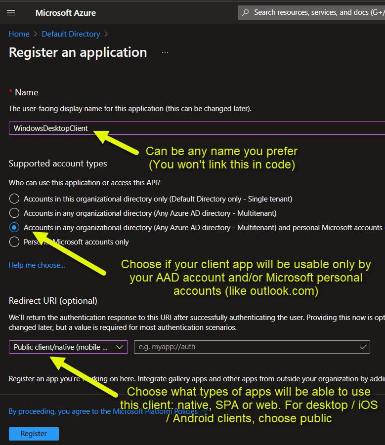
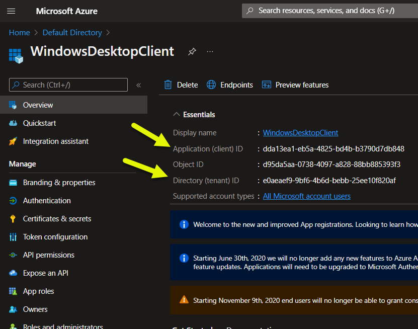

# Create a new Application in Azure AD (OAuth Authorization Flow)

The first step to create a client that consumes APIs protected by Azure AD is to register an Application in Azure AD.  
You will then grant this Application the possibility to access APIs (both Microsoft's and created by you).  
To start, go to the Azure Active Directory resource in your Azure Portal, click on App registrations and register a new application in the directory.
### 1

### 2

### 3
In your application code, you will need these data provided by AAD: Client ID and Tenant ID (the latter is the same for all of your apps)

