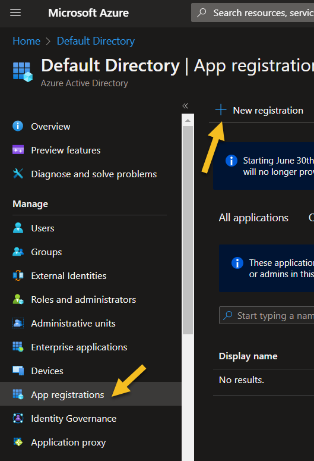

# Create a new Application in Azure AD (OAuth Authorization Flow)

The first step to be a client that consumes APIs protected by Azure AD is to create an Application Registration in Azure AD.  
You will then grant this Application the possibility to access APIs (both Microsoft's and created by you).  
To start, go to the Azure Active Directory resource in your Azure Portal, click on App registrations and register a new application in the directory.

