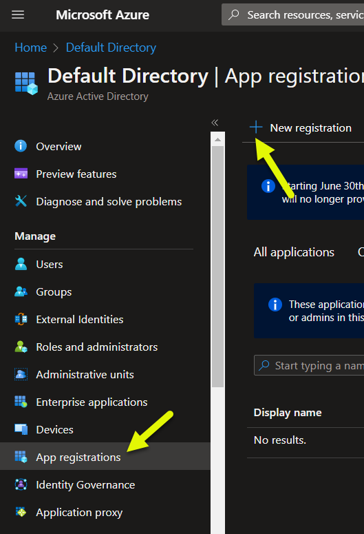
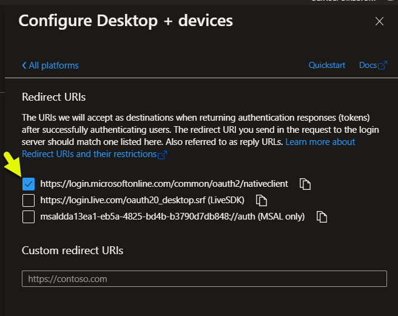

## Creating a new Application in Azure AD

To be able to consume APIs protected by Azure AD, first you have to register an Application in Azure AD.  
Then, you will then grant this Application the possibility to access specific APIs (Microsoft's and/or created by you).  
## 1
Go to the Azure Active Directory blade in your Azure Portal, click on App registrations and register a New Application in the directory.

## 2
Then, describe the characteristics of the application: name, audience, type. You can also choose the type of application you are creating (in this case, public client), but this will be done more easily later, with step (4)

## 3
Grab the IDs. In your application code, you will need these data provided by AAD: Client ID and Tenant ID (the latter is the same for all of your apps)

## 4a
Choose what type of client(s) you will create. Mobile and desktop clients have their own section.

## 4b
Your code will have to match, as a reply URL, the same URL you configure here:

