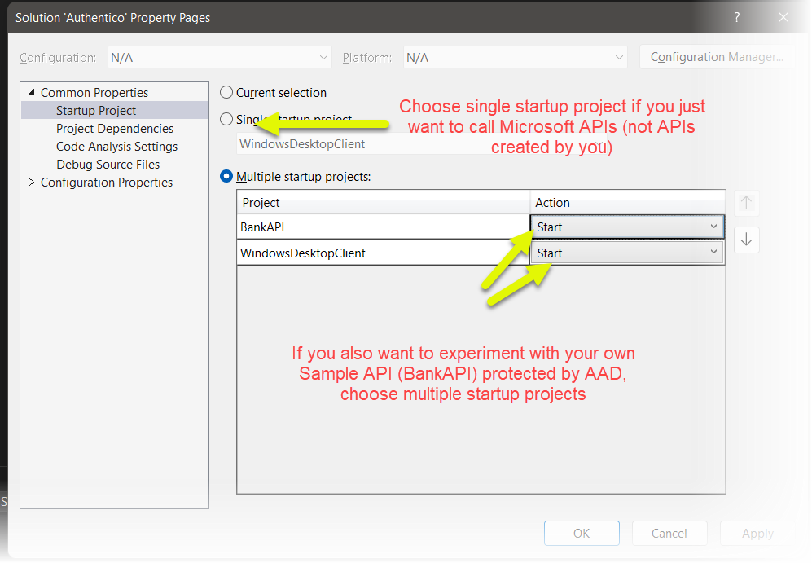
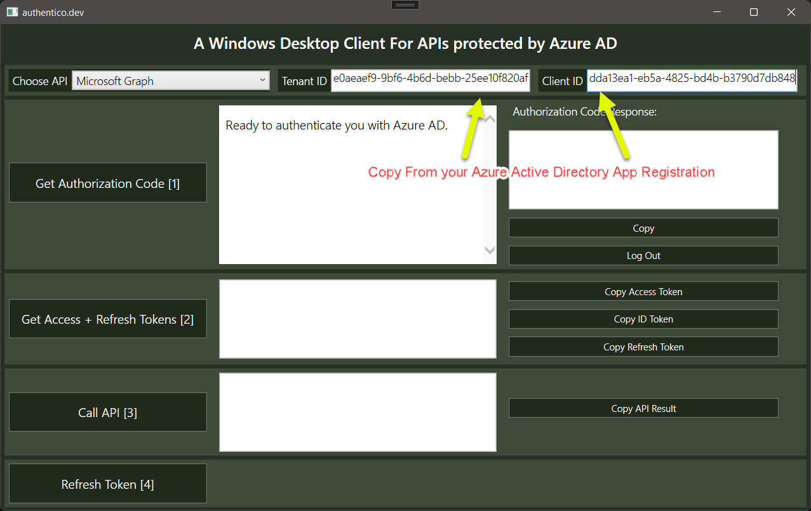

## How to build a Windows desktop client to access APIs protected by Azure AD 
In this sample, we will create a Windows WPF application that consumes APIs protected by Azure Active Direcory. Such an app will use the **OAUTH2 Authorization Flow** with the PKCE extension. I won't explain the concepts behind this flow as you can read about it in [Microsoft's docs](https://docs.microsoft.com/en-us/azure/active-directory/develop/v2-oauth2-auth-code-flow) or [auth0's docs](https://auth0.com/docs/get-started/authentication-and-authorization-flow/authorization-code-flow) or in the [IETF docs](https://datatracker.ietf.org/doc/html/rfc6749#section-4.1).

You can read [here (OAUTH.Net)](https://oauth.net/2/pkce/) about the PKCE extension and why it is necessary to be able to use it with desktop / mobile applications, which can't securely store a "secret".

Here is how to configure your desktop app:
### 1
As a first thing, make sure you create an Application Registration in Azure AD for your client. You can check [here](CreateAClientApplicationInAzureActiveDirectory.md) how to do it.
### 2
Download [this Visual Studio Solution](https://github.com/RiccardoGMoschetti/authentico). You will be interested in these two projects:
- WindowsDesktopClient
- BankAPI (this, only in case you want to experiment calling an API of your own, which you will configure to be protected by Azure AD)

Consequently, if you want to learn use the client for Microsoft APIs (as Microsoft Graph or the Azure ARM API), just launch the desktop client and leave the Bank API alone.

When the client runs, you need to fill the TenantID and ClientID you created at step (1).

